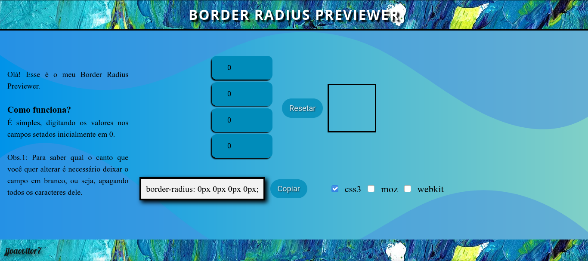

# BorderRadiusPreviewer

<p align="center">
  
</p>

<p align="center">
  <a href="https://forthebadge.com">  </a>
  <a href="https://forthebadge.com">  </a>
  <a href="https://forthebadge.com">  </a>
</p>

## :scroll: Sobre

Pré-visualizador de _border-radius_.

---

## :rocket: Tecnologias utilizadas

- HTML
- CSS
- JavaScript

---

## :computer: Como baixar o projeto

```bash
  // Clonar o repositório
  $ git clone https://github.com/jjoaovitor7/BorderRadiusPreviewer

  // Entrar no diretório
  $ cd BorderRadiusPreviewer
```

---
